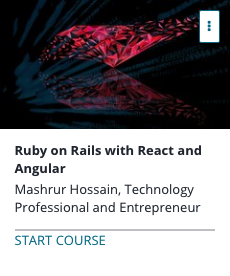

```
Roberto Nogueira  
BSd EE, MSd CE
Solution Integrator Experienced - Certified by Ericsson
```
# Udemy Ruby on Rails with React and Angular



**About **

Learn everything you need to about the subject of this `Udemy` project.

[Homepage](https://www.udemy.com/ruby-on-rails-react-angular/learn/v4/content)

## Topics
```
Section: 0
0 / 3
[x] 1. Introduction 0:48
[x] 2. Course Work Overview 2:14
[x] 3. Development Overview 0:00

Section: 1
0 / 10
React with Rails
[x] Quiz 1: Rails Basics 0:00
[x] 4. Getting Started with Alpha Blog 7:54
[x] 5. Getting Started with Alpha Blog - Text Directions and Code 0:00
[x] 6. Installing Webpacker and React 9:53
[x] 7. Installing Webpacker and React - Text Directions and Code 0:00
[x] Quiz 2: React on Rails Intro 0:00
[ ] 8. React-Rails and Pushing to GitHub 12:29
[ ] 9. React-Rails and Pushing to GitHub - Text Directions and Code 0:00
[ ] 10. Webpacker, React, and Yarn - Layout and Configuration 10:45
[ ] Assignment 1: Try React 0:00

Section: 2
0 / 18
React With Rails - The Article Component
[ ] 11. React - How It Works 9:39
[ ] 12. Starting the Article Component 7:10
[ ] 13. Starting the Article Component - Text Directions and Code 0:00
[ ] 14. Article Component continued 9:12
[ ] 15. Article Component continued - Text Directions and Code 0:00
[ ] 16. Finishing Article Component 10:55
[ ] 17. Finishing Article Component - Text Directions and Code 0:00
[ ] Quiz 3: Reviewing the Article Component Build 0:00
[ ] 18. Adding a Timestamp Component 8:07
[ ] 19. Adding a Timestamp Component - Text Directions and Code 0:00
[ ] 20. Timestamp Component continued 7:25
[ ] 21. Timestamp Component continued - Text Directions and Code 0:00
[ ] Quiz 4: Timestamp Component Review 0:00
[ ] 22. React Component LifeCycle - ComponentDidMount 7:49
[ ] 23. React Component LifeCycle - Component DidMount - Text Directions and Code 0:00
[ ] 24. React Component LifeCycle - ComponentDidUnmount 7:38
[ ] 25. React Component LifeCycle - ComponentDidUnmount - Text Directions and Code 0:00
[ ] Quiz 5: React Components Review 0:00

Section: 3
0 / 25
React with Rails - The Colorpicker Component
[ ] 26. Colorpicker Component Introduction 8:52
[ ] 27. Colorpicker Component Introduction - Text Directions and Code 0:00
[ ] 28. Creating the Colorpicker 7:36
[ ] 29. Creating the Colorpicker - Text Directions and Code 0:00
[ ] Quiz 6: Rails Model Review 0:00
[ ] 30. Adding Color to Users 8:47
[ ] 31. Adding Color to Users - Text Directions and Code 0:00
[ ] 32. Adding Colorpicker to the Form 4:32
[ ] 33. Adding Colorpicker to the Form - Text Directions and Code 0:00
[ ] 34. Creating the Colorpicker Constructor 6:06
[ ] 35. Creating the Colorpicker Constructor - Text Directions and Code 0:00
[ ] Quiz 7: Colorpicker Quiz 0:00
[ ] 36. The handleChange Function 8:20
[ ] 37. The handleChange Function - Text Directions and Code 0:00
[ ] 38. Improving the handleChange Function 5:59
[ ] 39. Improving the handleChange Function - Text Directions and Code 0:00
[ ] 40. Wiring the Component to the Form Field 7:19
[ ] 41. Wiring the Component to the Form Field - Text Directions and Code 0:00
[ ] Quiz 8: Colorpicker Quiz 2 0:00
[ ] 42. Updating the App to Use Preferred Color 9:16
[ ] 43. Updating the App to Use Preferred Color - Text Directions and Code 0:00
[ ] 44. Cleaning Up and Nice to Haves 6:20
[ ] 45. Cleaning Up and Nice to Haves - Text Directions and Code 0:00
[ ] 46. Review and Summary 4:28
[ ] 47. React - Assignment 0:00

Section: 4
0 / 54
Angular with Rails - My Portfolio
[ ] 48. Introduction to Finance Tracker 6:49
[ ] 49. Introduction to Finance Tracker - Text Directions and Code 0:00
[ ] 50. Application Overview 5:49
[ ] Coding Exercise 1: Find the right object 0:00
[ ] 51. Adding AngularJS to the App 8:10
[ ] 52. Adding AngularJS to the App - Text Directions and Code 0:00
[ ] 53. Starting the Angular App 5:13
[ ] 54. Starting the Angular App - Text Directions and Code 0:00
[ ] 55. Creating the Repo and Pushing to GitHub 5:11
[ ] 56. Creating the Repo and Pushing to GitHub - Text Directions and Code 0:00
[ ] 57. Starting to Change Stock Lookup 8:34
[ ] Quiz 9: Angular concepts 0:00
[ ] 58. Setting Up Stocks Controller 7:52
[ ] 59. Setting Up StocksController - Text Directions and Code 0:00
[ ] 60. Changing the Form to Plain HTML 11:23
[ ] 61. Changing the Form to Plain HTML - Text Directions and Code 0:00
[ ] 62. The Lookup Function 6:58
[ ] 63. The Lookup Function - Text Directions and Code 0:00
[ ] 64. Binding the Results to the Lookup Function 5:49
[ ] 65. Binding the Results to the Lookup Function - Text Directions and Code 0:00
[ ] Quiz 10: Angular concepts 2 0:00
[ ] 66. Changing the Results Partial from Rails to Angular 9:00
[ ] 67. Changing the Results Partial from Rails to Angular - Text Directions and Code 0:00
[ ] 68. Moving the Results Partial Back into My Portfolio 7:39
[ ] 69. Moving the Results Partial Back into My Portfolio - Text Directions and Code 0:00
[ ] 70. Turning the Rails Controller into an API 7:07
[ ] 71. Turning the Rails Controller into an API - Text Directions and Code 0:00
[ ] 72. Overview of Changes to the Models 4:42
[ ] Quiz 11: Rails API Review 0:00
[ ] 73. Modifying the Stock Model 5:15
[ ] 74. Modifying the Stock Model - Text Directions and Code 0:00
[ ] 75. Adding the StockService 5:38
[ ] 76. Adding the StockService - Text Directions and Code 0:00
[ ] 77. Building the Lookup Function 7:29
[ ] 78. Building the Lookup Function - Text Directions and Code 0:00
[ ] Quiz 12: Angular Service and API Quiz 0:00
[ ] 79. Adding Error Handling to Lookup 9:05
[ ] 80. Adding Error Handling to Lookup - Text Directions and Code 0:00
[ ] 81. Cleanup and Error Display 6:24
[ ] 82. Cleanup and Error Display - Text Directions and Code 0:00
[ ] 83. Beginning the Add Functionality 6:38
[ ] 84. Beginning the Add Functionality - Text Directions and Code 0:00
[ ] 85. Error Handling for Add 6:14
[ ] 86. Error Handling for Add - Text Directions and Code 0:00
[ ] Quiz 13: Angular Error Handling and Add Functionality Quiz 0:00
[ ] 87. Converting the UserStock Controller Add Action to API 7:54
[ ] 88. Converting the UserStock Controller Add Action to API - Text Directions and Code 0:00
[ ] 89. Finishing the Add Functionality and Troubleshooting a Bug 5:11
[ ] 90. Finishing the Add Functionality and Troubleshooting a Bug - Text & Code 0:00
[ ] 91. Making the Stock List Display Dynamic 8:20
[ ] 92. Making the Stock List Display Dynamic - Text Directions and Code 0:00
[ ] 93. Removing Extra Flash Messages and Wrapping Up 7:17
[ ] 94. Removing Extra Flash Messages and Wrapping Up - Text Directions and Code 0:00
[ ] Quiz 14: My Portfolio Review Quiz 0:00

Section: 5
0 / 25
Angular with Rails - My Friends
[ ] 95. Overview of Friendships Feature Back End 9:46
[ ] 96. Friendships Front End and Starting Conversion to Angular 7:38
[ ] 97. Friendships Front End and Starting Conversion to Angular - Text & Code 0:00
[ ] 98. Changing Lookup Form to Angular 7:15
[ ] 99. Changing Lookup Form to Angular - Text Directions and Code 0:00
[ ] 100. Adding Friend Lookup Angular Controller and Service 8:01
[ ] 101. Adding Friend Lookup Angular Controller and Service - Text Directions and Code 0:00
[ ] Quiz 15: Angular concepts 3 Quiz 0:00
[ ] 102. Changing Friend Lookup Controller to API 5:07
[ ] 103. Changing Friend Lookup Controller to API - Text Directions and Code 0:00
[ ] 104. Removing Rails Code from the Lookup Partial 8:44
[ ] 105. Removing Rails Code from the Lookup Partial - Text Directions and Code 0:00
[ ] 106. Adding Profile Path to the API 6:13
[ ] 107. Adding Profile Path to the API - Text Directions and Code 0:00
[ ] Quiz 16: Friends Lookup Quiz 0:00
[ ] 108. Creating and Using the Friend Already Helper 7:26
[ ] 109. Creating and Using the Friends Already Helper - Text Directions and Code 0:00
[ ] 110. Angular Controller and Service for Add Friend 8:39
[ ] 111. Angular Controller and Service for Add Friend - Text Directions and Code 0:00
[ ] Quiz 17: Add Friend Quiz 0:00
[ ] 112. Changing the Add Friend Controller and Message Display 7:34
[ ] 113. Changing the Add Friend Controller and Message Display - Text Directions & Code 0:00
[ ] 114. Dynamic Friends List and App Review 7:50
[ ] 115. Dynamic Friends List and App Review - Text Directions and Code 0:00
[ ] 116. AngularJS - Assignment 0:00

Section: 6
0 / 2 Summary
[ ] 117. Thank You 0:34
[ ] 118. Appendix A: Deploying to Heroku 0:00
```
